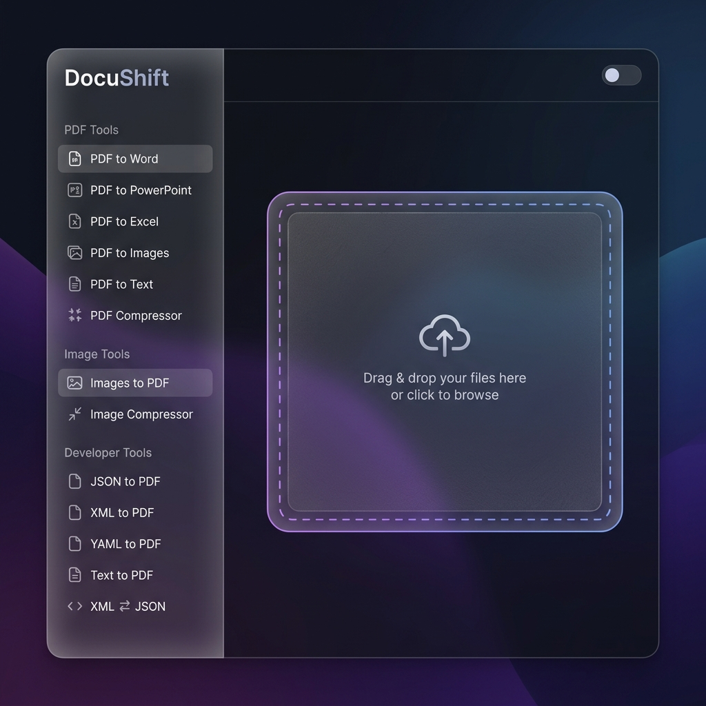
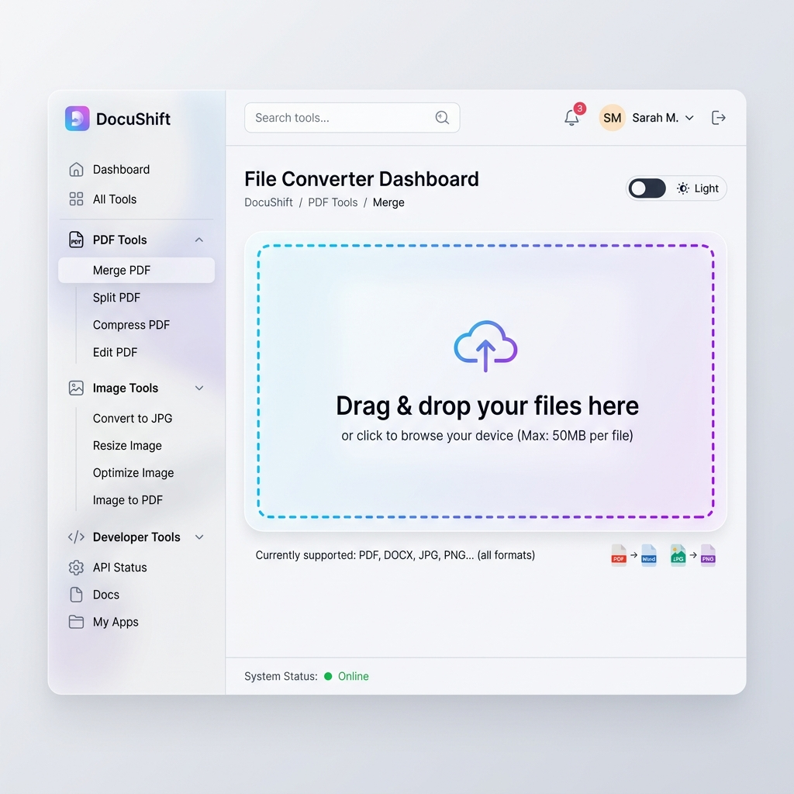
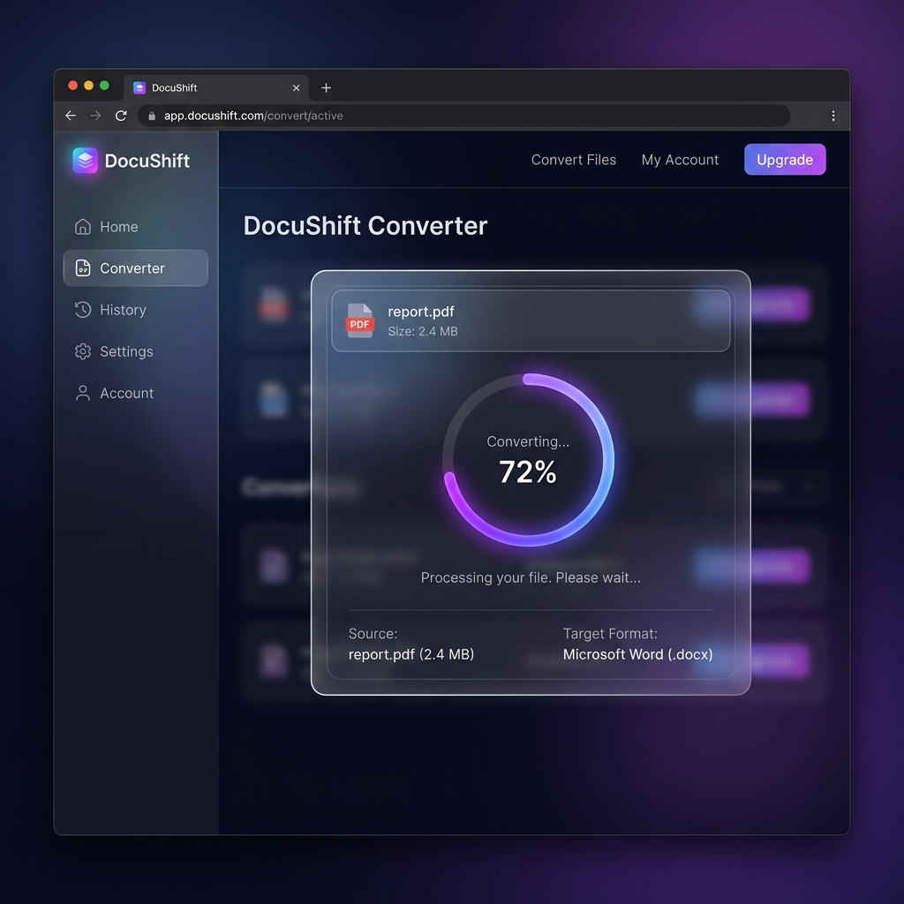

# DocuShift - Unified File Converter Suite

🚀 **Live Demo:** [https://satyampandey07.github.io/DocuShift/](https://satyampandey07.github.io/DocuShift/)

DocuShift is a **privacy-first, local-first** file conversion and compression suite built with **Python Flask**. All processing happens entirely on your machine - your files never leave your computer.

---

## 📸 Application Screenshots

### Dashboard — Dark Mode


The main dashboard in **dark mode** features a sleek glassmorphism UI with a collapsible sidebar navigation. All 13+ conversion tools are organized into three categories — **PDF Tools**, **Image Tools**, and **Developer Tools** — for quick access. The central drag-and-drop upload zone allows users to select files effortlessly.

---

### Dashboard — Light Mode


Switch to **light mode** with a single click using the built-in theme toggle. The light theme retains the glassmorphic translucency and modern aesthetics while offering a softer, easier-on-the-eyes experience for daytime use. All tools and navigation remain fully accessible.

---

### File Conversion in Progress


When a file is being converted, DocuShift displays a **real-time progress overlay** with a circular progress indicator, source file details (name and size), and the target output format. The conversion runs locally on your machine, ensuring complete privacy — no files are uploaded to any external server.

---

## ✨ Features

| Category | Tools |
|---|---|
| **PDF Tools** | PDF → Word (.docx), PDF → PowerPoint (.pptx), PDF → Excel (.xlsx), PDF → Images (.zip), PDF → Text (.txt), PDF Compressor |
| **Image Tools** | Images → PDF, Image Compressor |
| **Developer Tools** | JSON → PDF, XML → PDF, YAML → PDF, Text → PDF, XML ⇄ JSON Converter |

## 🚀 Getting Started

### Prerequisites
- Python 3.8+

### Installation & Run

```bash
# Clone the repository
git clone https://github.com/SatyamPandey07/DocuShift.git
cd DocuShift

# Run the boot script (auto-creates venv and installs dependencies)
chmod +x run.sh
./run.sh
```

Then open your browser at: **http://localhost:5001**

### Manual Setup (Optional)
```bash
python3 -m venv .venv
source .venv/bin/activate
pip install -r requirements.txt
python3 app.py
```

## 📦 Tech Stack

- **Backend**: Python, Flask
- **PDF Processing**: PyMuPDF (fitz), pdf2docx
- **Office Formats**: python-pptx, openpyxl, pandas
- **Image Processing**: Pillow
- **Frontend**: Vanilla HTML, CSS, JavaScript (glassmorphism UI with dark/light theme)

## 🎨 UI Highlights

- Glassmorphism dark/light theme toggle
- Animated drag-and-drop file upload zones
- Real-time conversion progress overlay
- Sidebar navigation with 13+ tools

## 📄 License

Developed by **Satyam Pandey**
